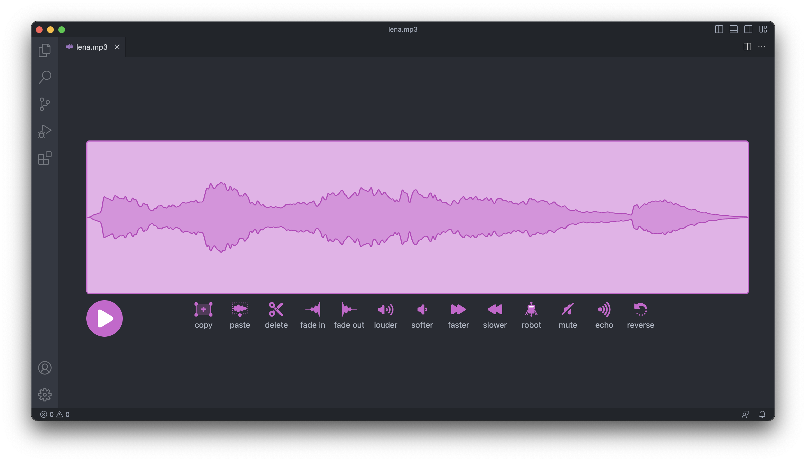

   
   <h2>Sound Editor for Visual Studio Code</h2>
   <h4>Visual Studio Code Extensions for Sound Editing. Based on <a href="https://github.com/llk/scratch-gui">sratch-gui</a></h4>
   
   

## Features✨
- Support Two Audio Formats (WAVE / MP3)
- Support Browser
- Support 10 Effects (FADEIN / FADEOUT / ECHO / REVERSE / LOUDER / SOFTER / FASTER / SLOWER / ROBOT / MUTE)

## Screen Shot 📷

## Contribution 👪
- If you found a plobrem, Please Create Issue on Github Repo.
- If you like it, Please Give Star🎇 to Me ! I'm Encourging 😎
